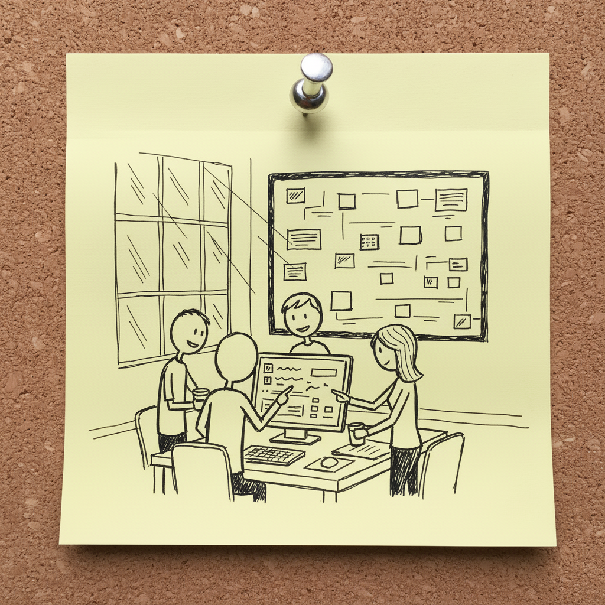
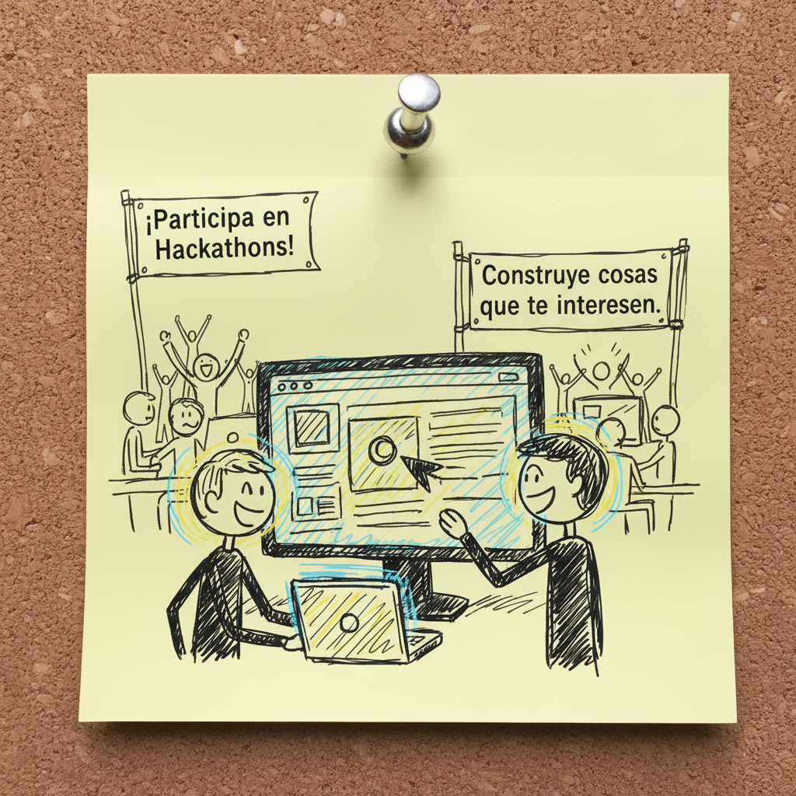
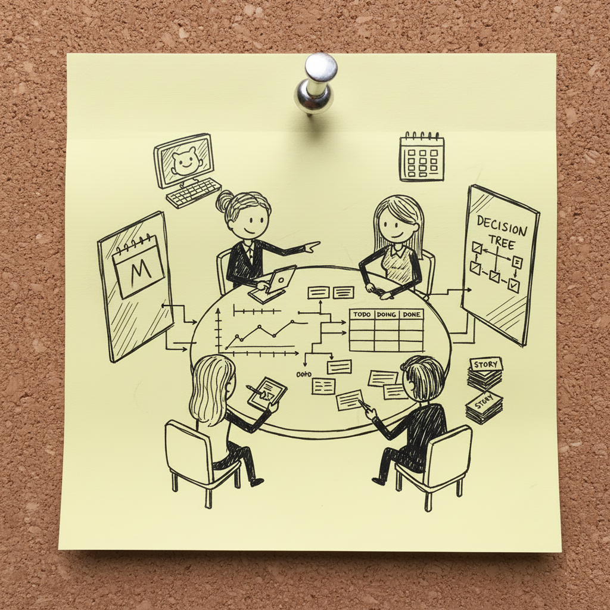
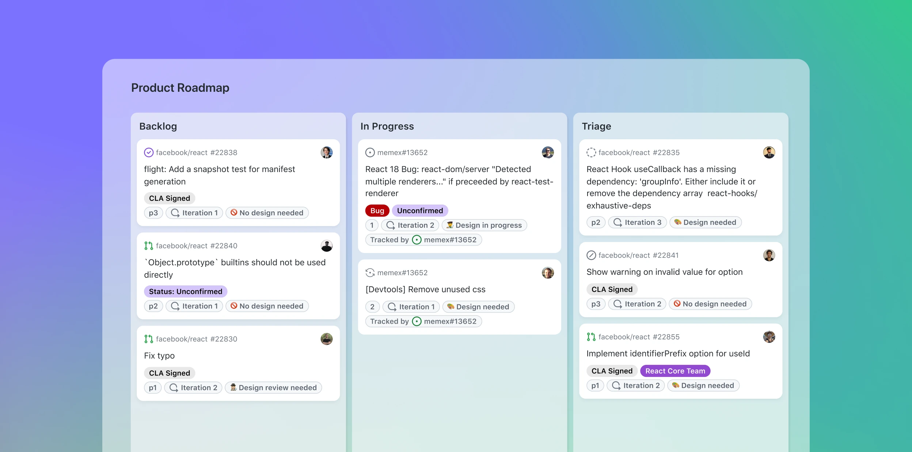
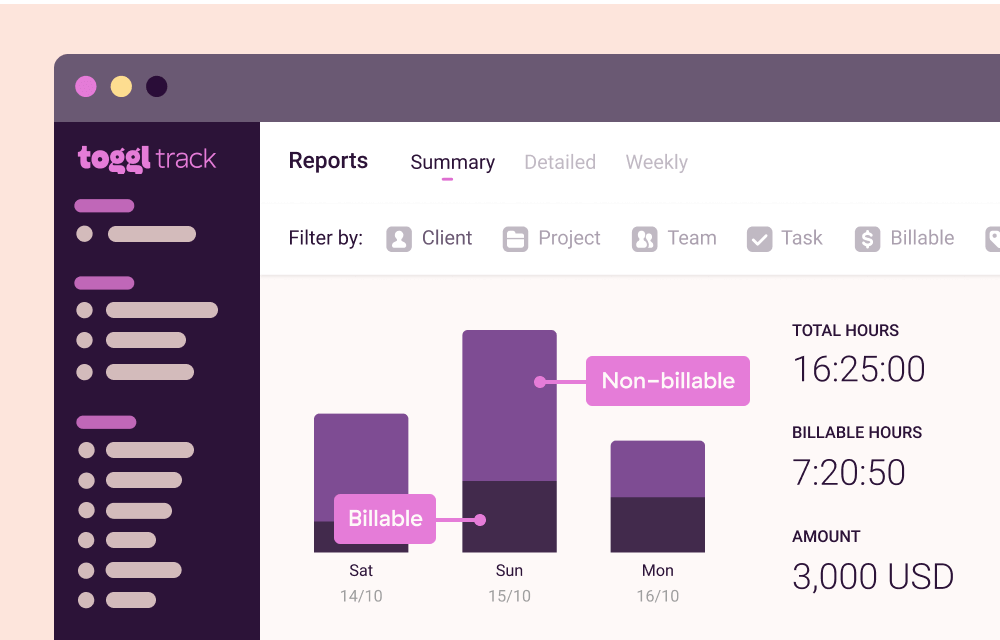
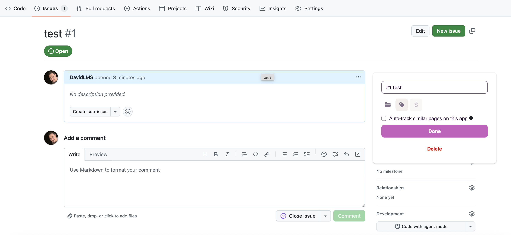
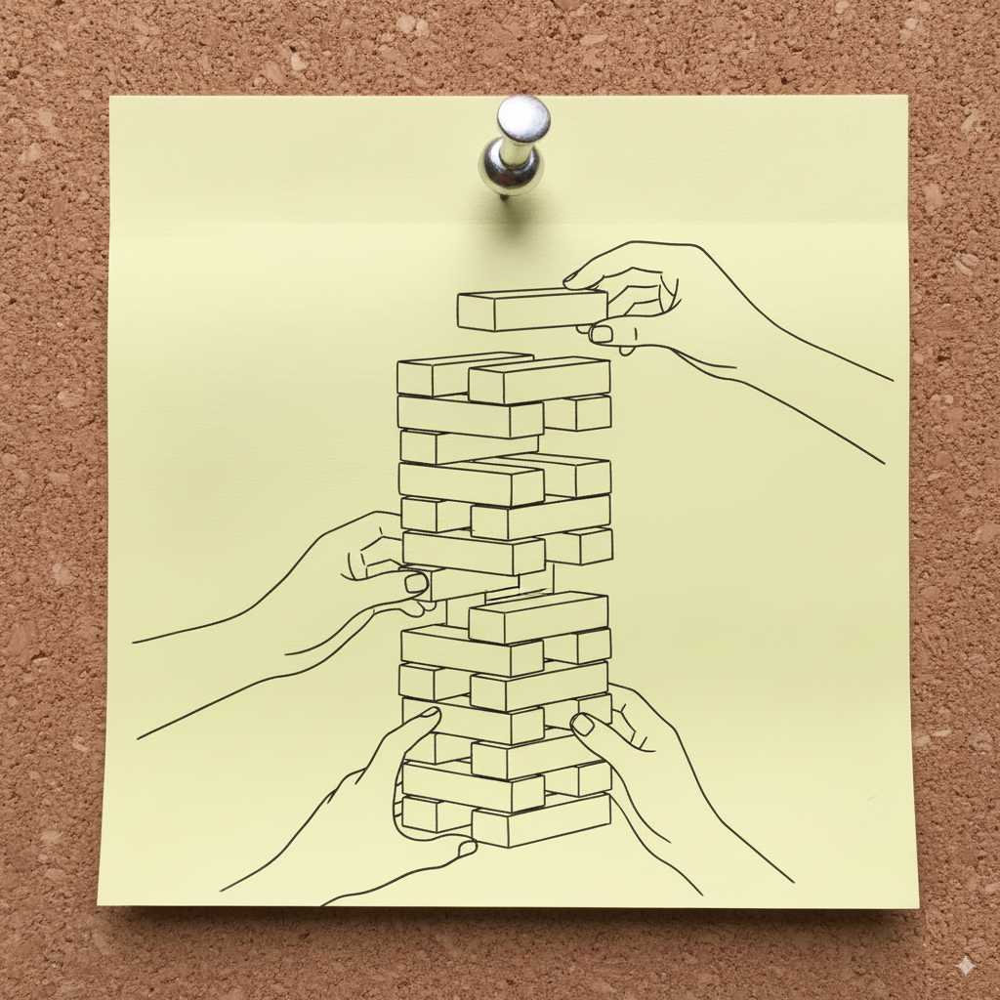
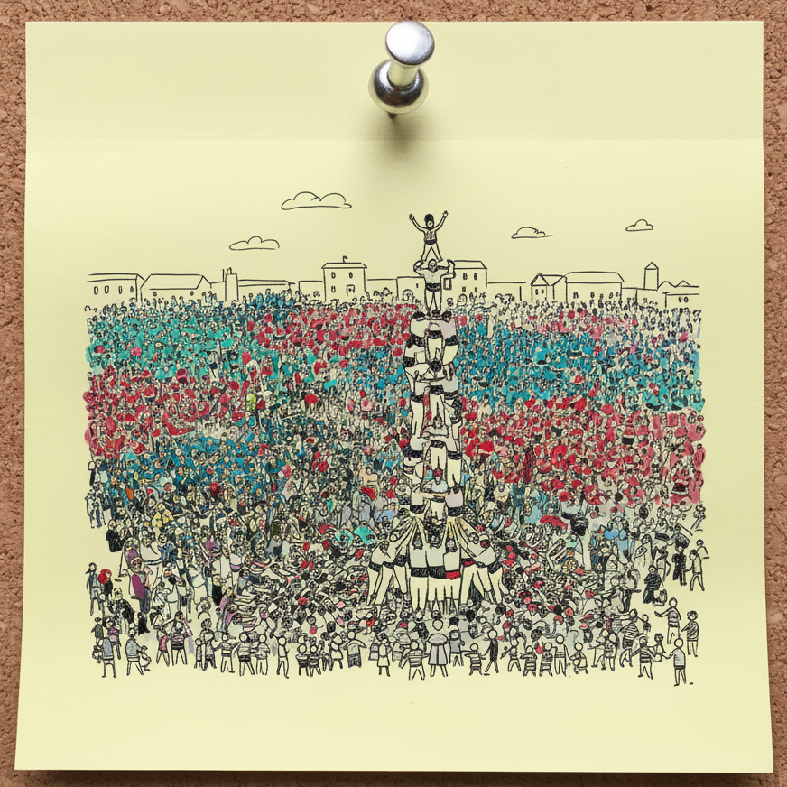
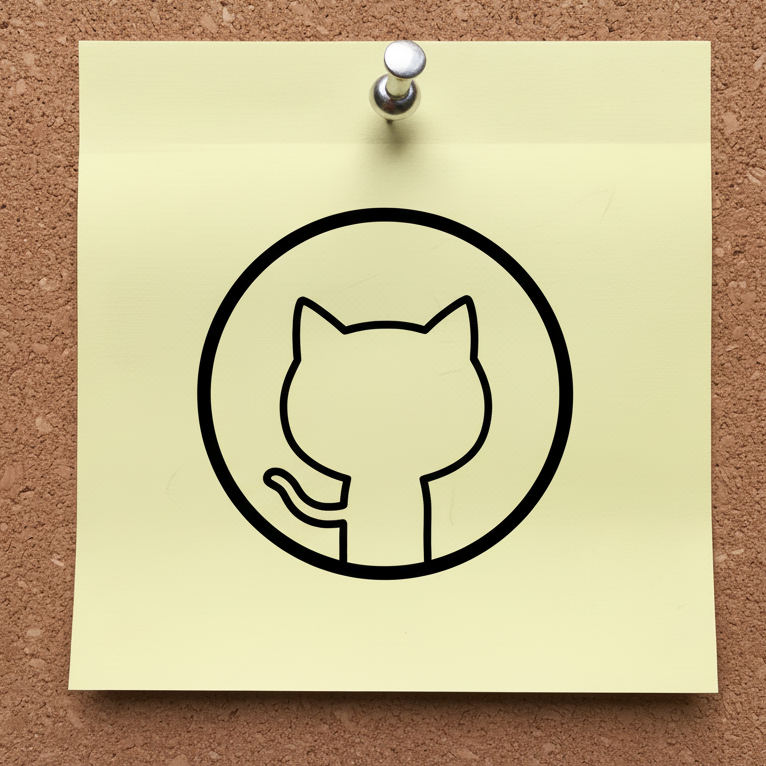

<h2 class="r-fit-text" style="text-align: center"> Proyecto Intermodular</h2>

---

## Unidad 1: Yo contigo, tú conmigo

---

## Hablemos de proyectos

Los proyectos como medio de aprendizaje

¿Solo dos? No es lo recomendable<!-- .element: class="fragment" -->

Construye cosas que te interesen<!-- .element: class="fragment" -->

¡Participa en Hackathons!<!-- .element: class="fragment" -->

## Ejemplo de participación en Hackathon

<small>https://github.com/DavidLMS/bananamd</small>
---

## La importancia de la gestión

¿Cómo gestionamos un proyecto con éxito?

¿La elección de herramientas es importante?<!-- .element: class="fragment" -->

## Github Projects

## ¿Cómo estimamos?

## Flujo de trabajo propuesto

1 - Convertir tarea en Issue

2 - Crear rama para el Issue

3 - Arrancar timer

4 - Trabajamos en la tarea

5.1 - Si no está terminada, ponemos un comentario en el issue explicando nuestro trabajo

5.2 - Si está terminada, ponemos un comentario explicativo, cerramos el issue y creamos un PR si es necesario

6 - Paramos el timer

## ¡A ponerlo en práctica!

---

## La formación de un equipo

## ¿Cómo soy?

Registro en https://eduteams.iiia.csic.es/
---

## Sigue una metodología en equipo

## SCRUM

Metodología ágil <!-- .element: class="fragment" -->

Mayor valor en el menor tiempo posible <!-- .element: class="fragment" -->

Útil cuando las tareas son difíciles de estimar <!-- .element: class="fragment" -->

## Características SCRUM

Equipo auto-organizado <!-- .element: class="fragment" -->

Producto avanza con "Sprints" de dos semanas a un mes <!-- .element: class="fragment" -->

Se parte de una lista viva de requisitos <!-- .element: class="fragment" -->

## Ciclo SCRUM

## Qué pasa en un Sprint

Se diseñan, programan y testean nuevas funcionalidades <!-- .element: class="fragment" -->

No se plantean cambios <!-- .element: class="fragment" -->

¿Es la velocidad adecuada? <!-- .element: class="fragment" -->

## Terminología de SCRUM

Roles <!-- .element: class="fragment" -->

Reuniones <!-- .element: class="fragment" -->

Artefactos <!-- .element: class="fragment" -->

## Roles

Product Owner <!-- .element: class="fragment" -->

ScrumMaster <!-- .element: class="fragment" -->

Team <!-- .element: class="fragment" -->

## 

## Reuniones

Sprint planning <!-- .element: class="fragment" -->

Sprint review <!-- .element: class="fragment" -->

Sprint retrospective <!-- .element: class="fragment" -->

Daily scrum meeting <!-- .element: class="fragment" -->

##

[Página 15](https://www.unab.edu.sv/wp-content/uploads/2020/05/Administracion-agil-de-proyectos-de-software.pdf)

## Artefactos

Product backlog <!-- .element: class="fragment" -->

Sprint backlog <!-- .element: class="fragment" -->

Burndown charts <!-- .element: class="fragment" -->

## Ejemplo de Sprint backlog

## Ejemplo de Burndown chart

## Un repaso al flujo SCRUM

## SCRUM en GitHub

Las iteraciones son Sprints <!-- .element: class="fragment" -->

Plantillas de Issues <!-- .element: class="fragment" -->

Campos para complejidad y prioridad <!-- .element: class="fragment" -->

---

## Cómo vamos a implementar SCRUM

GitHub Project: Definición y control de tareas

Wiki del repositorio: Documentación de la metodología  <!-- .element: class="fragment" -->

Toggl Track: Medición del tiempo <!-- .element: class="fragment" -->

## Tablero en GitHub Project

Nombre de la tarea <!-- .element: class="fragment" -->

Asignación <!-- .element: class="fragment" -->

Estado <!-- .element: class="fragment" -->

Estimación <!-- .element: class="fragment" -->

Prioridad

Categoría (frontend, backend, BD) <!-- .element: class="fragment" -->

Sprint <!-- .element: class="fragment" -->

## Roles

Scrum Master, Product Owner y equipo de desarrollo <!-- .element: class="fragment" -->

Rotan en cada sprint <!-- .element: class="fragment" -->

Se documenta en la Wiki <!-- .element: class="fragment" -->

Alguien se encarga de la gestión de Toggl  <!-- .element: class="fragment" -->

## Scrum Master

Facilita y documenta las reuniones <!-- .element: class="fragment" -->

Elimina bloqueos <!-- .element: class="fragment" -->

Mantiene actualizado el tablero <!-- .element: class="fragment" -->

## Product Owner

Define prioridades <!-- .element: class="fragment" -->

Decide qué hacer en el sprint <!-- .element: class="fragment" -->

Supervisa entregas <!-- .element: class="fragment" -->

## Equipo de desarrollo

Realiza las tareas asignadas <!-- .element: class="fragment" -->

## Documentación de reuniones

Daily: Solo impedimentos <!-- .element: class="fragment" -->

Sprint Review: Directamente en tablero <!-- .element: class="fragment" -->

Sprint Retrospective: ¿Qué funcionó bien durante el Sprint? y ¿Qué podemos mejorar para el próximo Sprint? <!-- .element: class="fragment" -->

## Recuerda el flujo SCRUM

Cada día: Daily <!-- .element: class="fragment" -->

Sprint Planning <!-- .element: class="fragment" -->

Trabajamos <!-- .element: class="fragment" -->

Sprint Review <!-- .element: class="fragment" -->

Sprint Retrospective 

Sprint Planning <!-- .element: class="fragment" -->

## Recuerda el flujo de trabajo

Abro la tarea asignada con la prioridad más alta <!-- .element: class="fragment" -->

Empiezo a contar el tiempo <!-- .element: class="fragment" -->

Realizo la tarea  <!-- .element: class="fragment" -->

Si la termino: La cierro, hago PR y paro el tiempo

Si no la termino: Pongo comentario (qué he hecho/qué queda por hacer) y paro el tiempo <!-- .element: class="fragment" -->
---

<!-- .slide: data-background-video="assets/team.mp4" data-background-opacity="0.6" data-background-video-loop data-background-video-muted-->

## ¿Dudas?