<h2 class="r-fit-text" style="text-align: center"> Proyecto Intermodular</h2>


---

## Unidad 1: Yo contigo, tú conmigo


---

## Hablemos de proyectos

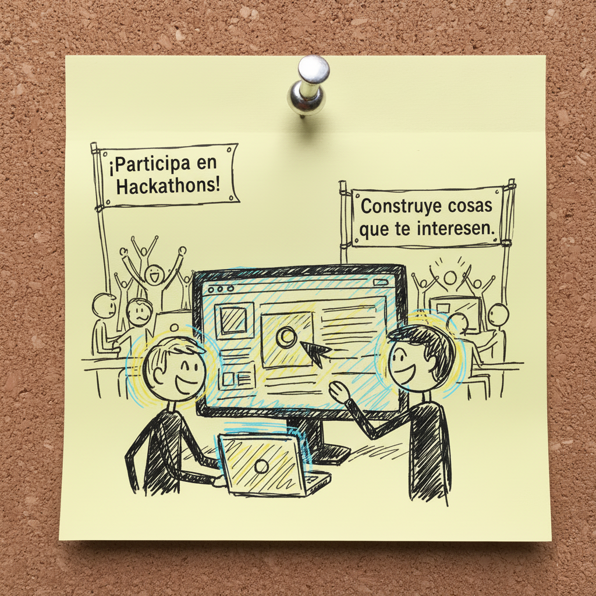


Los proyectos como medio de aprendizaje

¿Solo dos? No es lo recomendable<!-- .element: class="fragment" -->

Construye cosas que te interesen<!-- .element: class="fragment" -->

¡Participa en Hackathons!<!-- .element: class="fragment" -->


## Ejemplo de participación en Hackathon


<small>https://github.com/DavidLMS/bananamd</small>
---

## La importancia de la gestión


¿Cómo gestionamos un proyecto con éxito?

¿La elección de herramientas es importante?<!-- .element: class="fragment" -->


## Github Projects

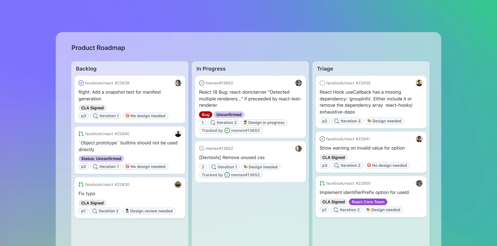


## ¿Cómo estimamos?

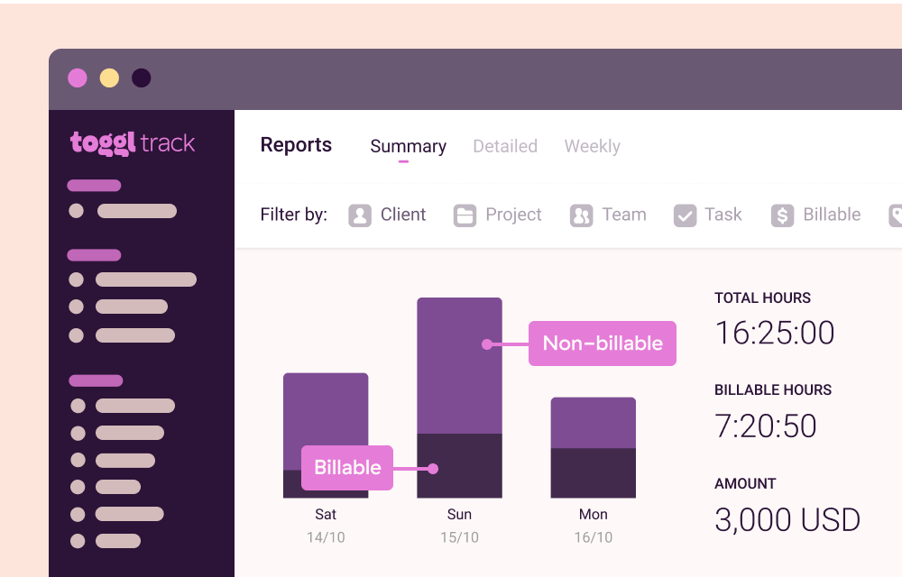


## Flujo de trabajo propuesto

1 - Convertir tarea en Issue

2 - Crear rama para el Issue

3 - Arrancar timer


4 - Trabajamos en la tarea

5.1 - Si no está terminada, ponemos un comentario en el issue explicando nuestro trabajo


5.2 - Si está terminada, ponemos un comentario explicativo, cerramos el issue y creamos un PR si es necesario

6 - Paramos el timer


## ¡A ponerlo en práctica!

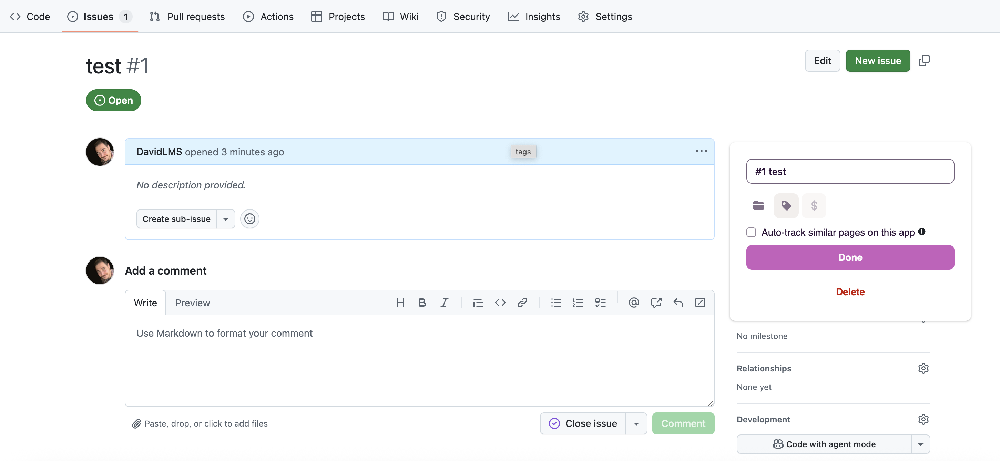
---

## La formación de un equipo


## ¿Cómo soy?

Registro en https://eduteams.iiia.csic.es/
---

## Sigue una metodología en equipo


## SCRUM

Metodología ágil <!-- .element: class="fragment" -->

Mayor valor en el menor tiempo posible <!-- .element: class="fragment" -->

Útil cuando las tareas son difíciles de estimar <!-- .element: class="fragment" -->


## Características SCRUM

Equipo auto-organizado <!-- .element: class="fragment" -->

Producto avanza con "Sprints" de dos semanas a un mes <!-- .element: class="fragment" -->

Se parte de una lista viva de requisitos <!-- .element: class="fragment" -->


## Ciclo SCRUM


## Qué pasa en un Sprint

Se diseñan, programan y testean nuevas funcionalidades <!-- .element: class="fragment" -->

No se plantean cambios <!-- .element: class="fragment" -->

¿Es la velocidad adecuada? <!-- .element: class="fragment" -->


## Terminología de SCRUM

Roles <!-- .element: class="fragment" -->

Reuniones <!-- .element: class="fragment" -->

Artefactos <!-- .element: class="fragment" -->


## Roles

Product Owner <!-- .element: class="fragment" -->

ScrumMaster <!-- .element: class="fragment" -->

Team <!-- .element: class="fragment" -->


## 


## Reuniones

Sprint planning <!-- .element: class="fragment" -->

Sprint review <!-- .element: class="fragment" -->

Sprint retrospective <!-- .element: class="fragment" -->

Daily scrum meeting <!-- .element: class="fragment" -->


##

[Página 15](https://www.unab.edu.sv/wp-content/uploads/2020/05/Administracion-agil-de-proyectos-de-software.pdf)


## Artefactos

Product backlog <!-- .element: class="fragment" -->

Sprint backlog <!-- .element: class="fragment" -->

Burndown charts <!-- .element: class="fragment" -->


## Ejemplo de Sprint backlog


## Ejemplo de Burndown chart


## Un repaso al flujo SCRUM


## SCRUM en GitHub

Las iteraciones son Sprints <!-- .element: class="fragment" -->

Plantillas de Issues <!-- .element: class="fragment" -->

Campos para complejidad y prioridad <!-- .element: class="fragment" -->

---

## Cómo vamos a implementar SCRUM

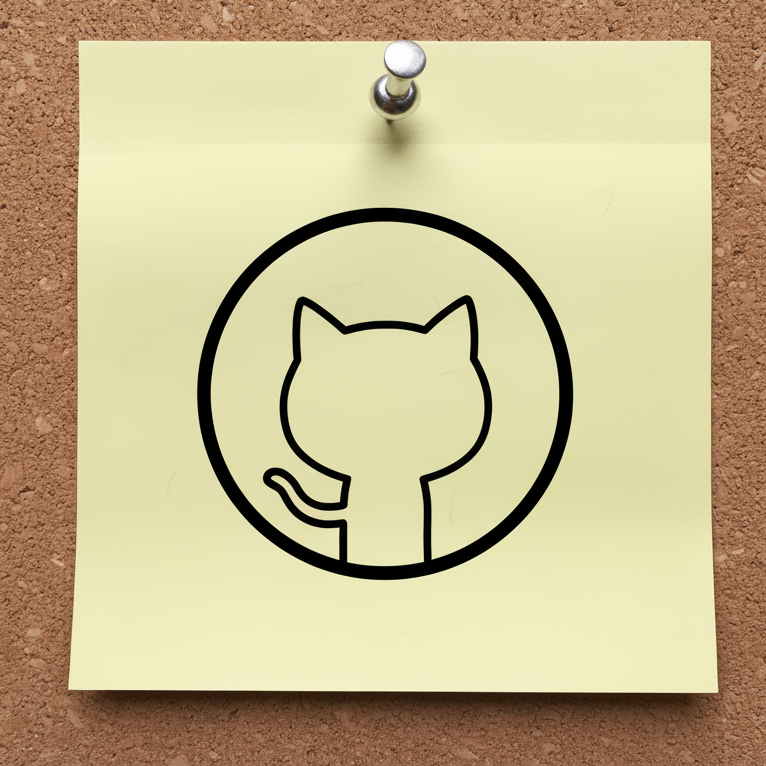


GitHub Project: Definición y control de tareas

Wiki del repositorio: Documentación de la metodología  <!-- .element: class="fragment" -->

Toggl Track: Medición del tiempo <!-- .element: class="fragment" -->


## Tablero en GitHub Project

Nombre de la tarea <!-- .element: class="fragment" -->

Asignación <!-- .element: class="fragment" -->

Estado <!-- .element: class="fragment" -->

Estimación <!-- .element: class="fragment" -->


Prioridad

Categoría (frontend, backend, BD) <!-- .element: class="fragment" -->

Sprint <!-- .element: class="fragment" -->


## Roles

Scrum Master, Product Owner y equipo de desarrollo <!-- .element: class="fragment" -->

Rotan en cada sprint <!-- .element: class="fragment" -->

Se documenta en la Wiki <!-- .element: class="fragment" -->

Alguien se encarga de la gestión de Toggl  <!-- .element: class="fragment" -->


## Scrum Master

Facilita y documenta las reuniones <!-- .element: class="fragment" -->

Elimina bloqueos <!-- .element: class="fragment" -->

Mantiene actualizado el tablero <!-- .element: class="fragment" -->


## Product Owner

Define prioridades <!-- .element: class="fragment" -->

Decide qué hacer en el sprint <!-- .element: class="fragment" -->

Supervisa entregas <!-- .element: class="fragment" -->


## Equipo de desarrollo

Realiza las tareas asignadas <!-- .element: class="fragment" -->


## Documentación de reuniones

Daily: Solo impedimentos <!-- .element: class="fragment" -->

Sprint Review: Directamente en tablero <!-- .element: class="fragment" -->

Sprint Retrospective: ¿Qué funcionó bien durante el Sprint? y ¿Qué podemos mejorar para el próximo Sprint? <!-- .element: class="fragment" -->


## Recuerda el flujo SCRUM

Cada día: Daily <!-- .element: class="fragment" -->

Sprint Planning <!-- .element: class="fragment" -->

Trabajamos <!-- .element: class="fragment" -->

Sprint Review <!-- .element: class="fragment" -->


Sprint Retrospective 

Sprint Planning <!-- .element: class="fragment" -->


## Recuerda el flujo de trabajo

Abro la tarea asignada con la prioridad más alta <!-- .element: class="fragment" -->

Empiezo a contar el tiempo <!-- .element: class="fragment" -->

Realizo la tarea  <!-- .element: class="fragment" -->


Si la termino: La cierro, hago PR y paro el tiempo

Si no la termino: Pongo comentario (qué he hecho/qué queda por hacer) y paro el tiempo <!-- .element: class="fragment" -->
---
## Testing visual de UI con Maestro


[¿Qué es Maestro?](https://maestro.dev/)


## Ventajas de usarlo

Testing de historias de usuario <!-- .element: class="fragment" -->

Optimización de experiencia de usuario <!-- .element: class="fragment" -->

Útil para revisiones <!-- .element: class="fragment" -->

Es de código abierto <!-- .element: class="fragment" -->


## Creación de un test

```
url: https://davidlms.com
 ---
- launchApp
- tapOn: "Spanish"
- tapOn: "English"
- assertVisible: "davidlms | A personal blog"
```


## Instalación y prueba

```
curl -fsSL "https://get.maestro.mobile.dev" | bash
```

```
maestro test nombre-archivo.yaml
```


## Automatiza con GitHub Actions

```yaml
name: Run Maestro Web Tests

on:
  workflow_dispatch:

  push:
    branches: [main]
  pull_request:
    branches: [main]

jobs:
  maestro-web:
    runs-on: ubuntu-latest

    steps:
      - name: Checkout code
        uses: actions/checkout@v3

      - name: Setup Java
        uses: actions/setup-java@v4
        with:
          distribution: 'temurin'
          java-version: '17'

      - name: Setup Chrome
        uses: browser-actions/setup-chrome@v2
        with:
          chrome-version: stable
          install-dependencies: true

      - name: Install Maestro
        run: |
          curl -fsSL "https://get.maestro.mobile.dev" | bash
          echo "$HOME/.maestro/bin" >> $GITHUB_PATH

      - name: Setup Xvfb for headless Chrome
        run: |
          sudo apt-get update
          sudo apt-get install -y xvfb
          sudo Xvfb :99 -screen 0 1920x1080x24 > /dev/null 2>&1 &
          sleep 2

      - name: Run Maestro Web Tests
        uses: nick-fields/retry@v3
        with:
          timeout_minutes: 5
          max_attempts: 2
          retry_on: error
          command: |
            export PATH="$HOME/.maestro/bin:$PATH"
            maestro test .maestro/ --format junit --output report.xml
        env:
          MAESTRO_CLI_NO_ANALYTICS: "1"
          DISPLAY: ":99"

      - name: Upload Test Report
        if: always()
        uses: actions/upload-artifact@v4
        with:
          name: maestro-test-report
          path: |
            report.xml
            ~/.maestro/tests/**/*
          if-no-files-found: warn
```

---
## Programación asistida por IA


## Recuerda: Los LLM

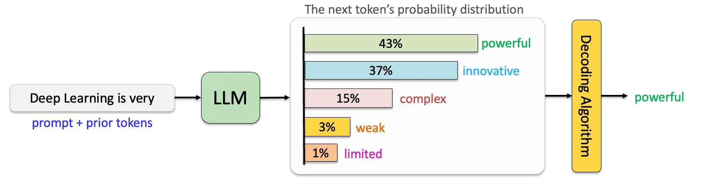


## 2022: Los completadores

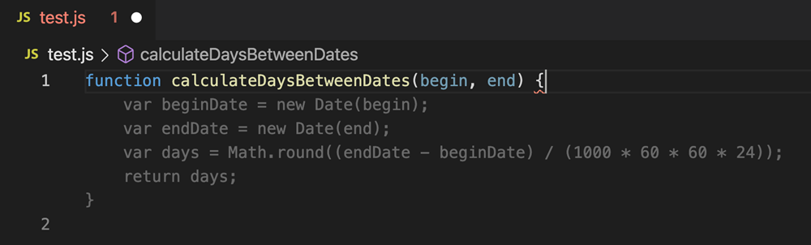

<small>Destacan GitHub Copilot y Tabnine</small>


## La programación es tab tab

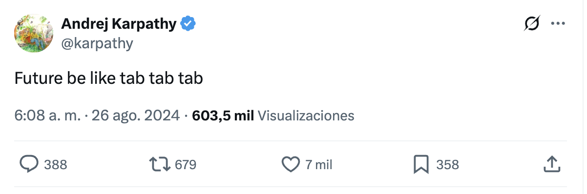


## 2023: Los chats

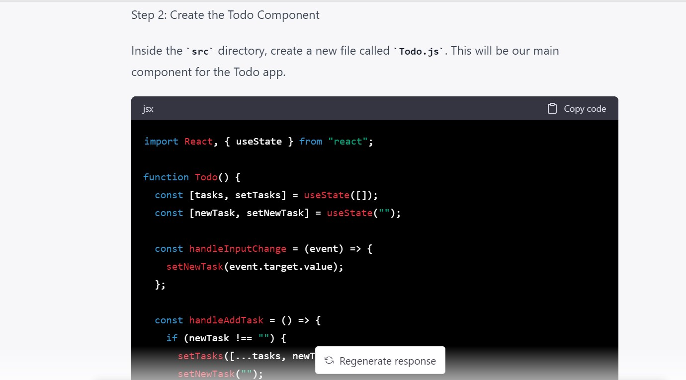


## El nuevo lenguaje de programación


## 2024: El uso de tools

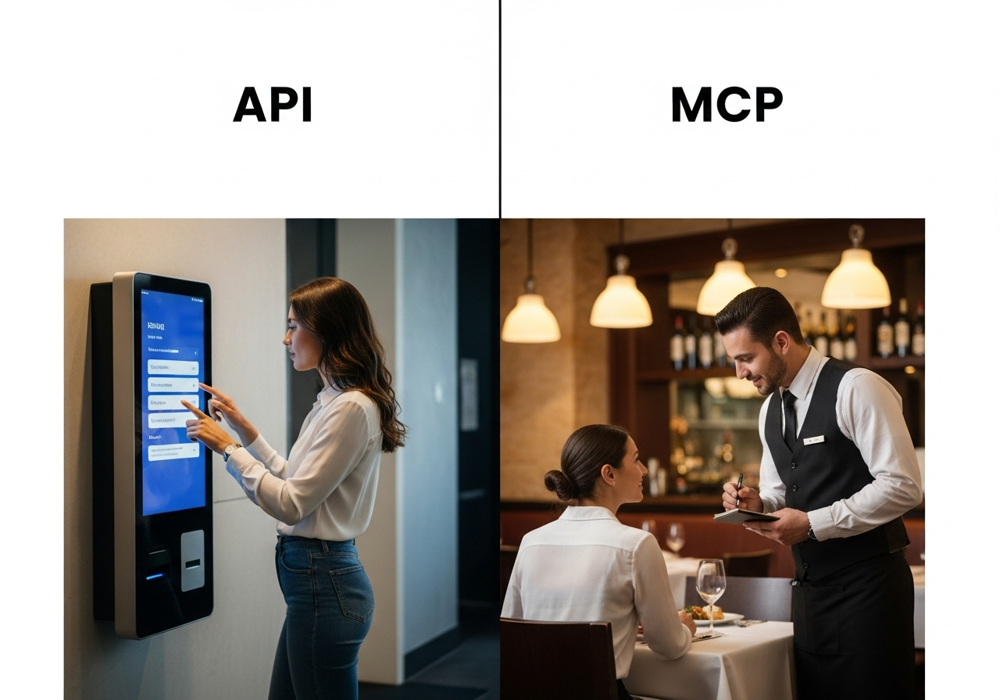


## 2025: La explosión de agentes cli

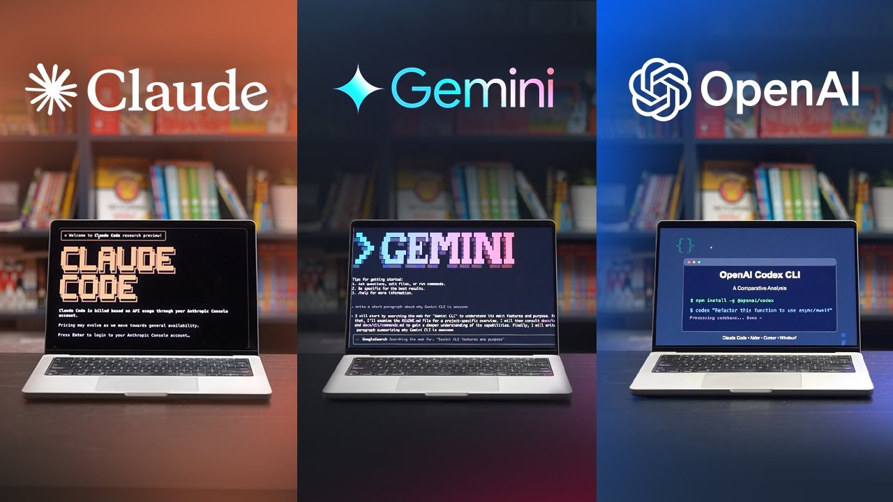


## La supuesta amenaza

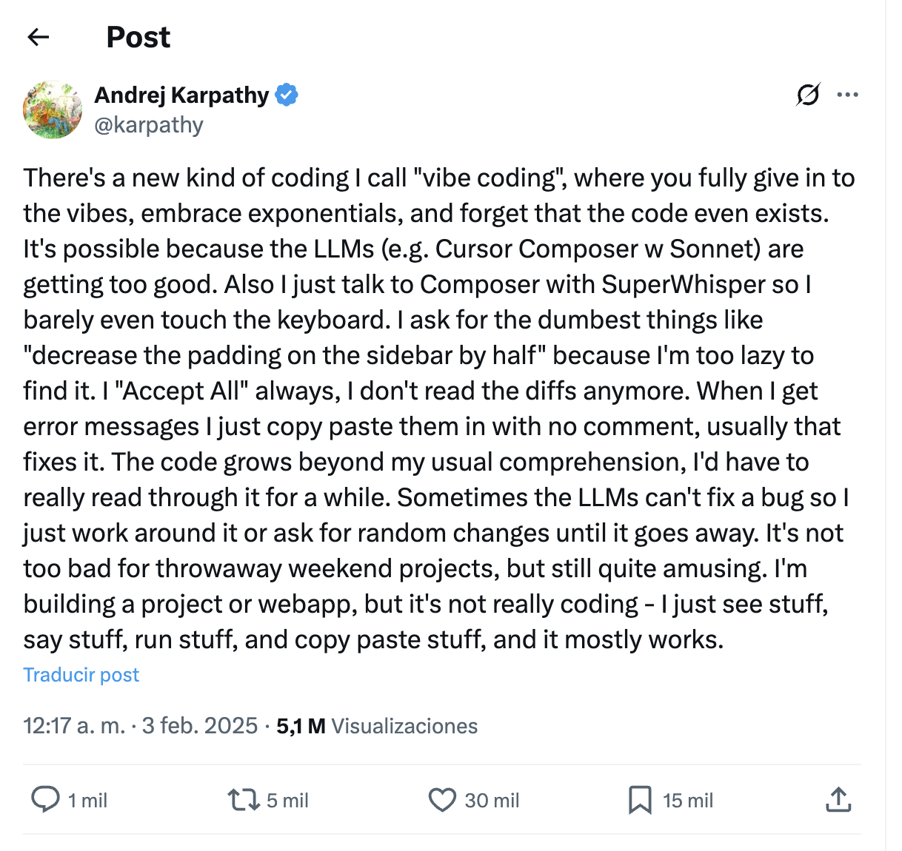


## La realidad

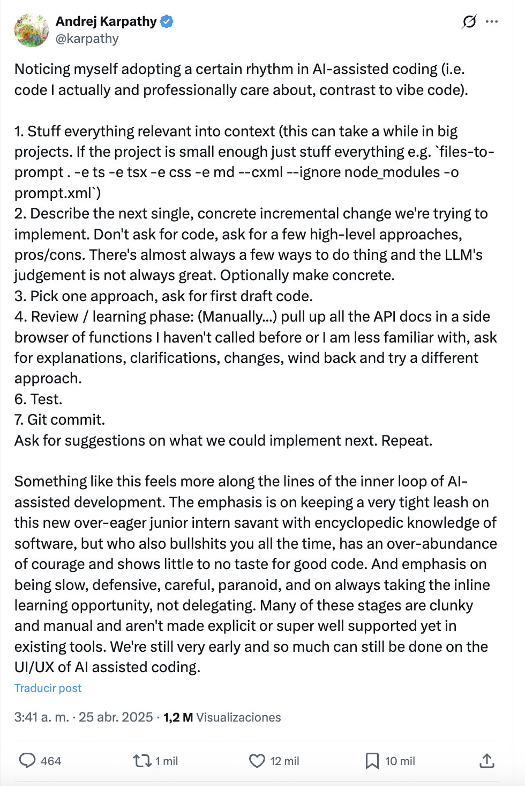


## Demo

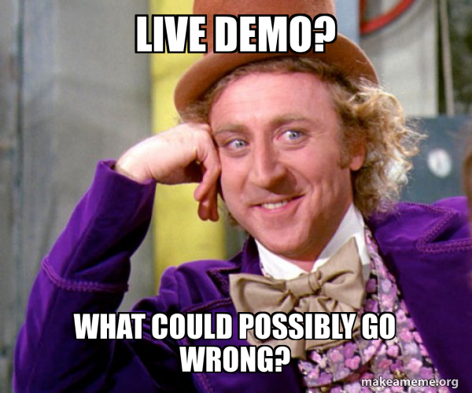


Mi primer proyecto MERN

Note:
Conectando con MCP Chrome y Context7, hacer web MERN de aprendizaje de MERN (con voz).


## Ideas de aprendizaje

Pide código <!-- .element: class="fragment" -->

Revisa el código <!-- .element: class="fragment" -->

Pregunta sobre el código <!-- .element: class="fragment" -->

Rehaz el código <!-- .element: class="fragment" -->

Note:
En una rama, decirle que elimine todo lo de un framework y que haga guía de ejercicios para implementarlo, abrir doc de framework con navegador agéntico y hacer preguntas. Intentar implementarlo, luego compararlo con la implementación. Hacer preguntas.


## ¿Más ideas?

Abre la documentación con un navegador agéntico <!-- .element: class="fragment" -->

Lee uno de los apartados <!-- .element: class="fragment" -->

Pregunta aclaraciones <!-- .element: class="fragment" -->

Pide que implemente un ejemplo de uso en tu aplicación <!-- .element: class="fragment" -->


## ¿No tienes suficiente?

Ensaya la defensa de tu proyecto


<!-- .slide: data-visibility="hidden" -->
## ¿Qué hacemos en clase entonces?

Mostrarte las cosas que no sabes que no sabes

Metodología de trabajo

Retroalimentación efectiva

Marcar un calendario


## Te puede ayudar a planificar

¿Has probado con tu propuesta?


## También en la nube

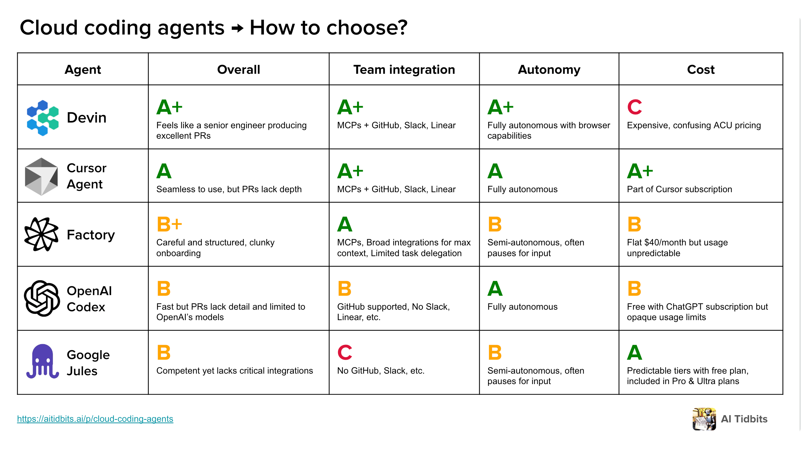


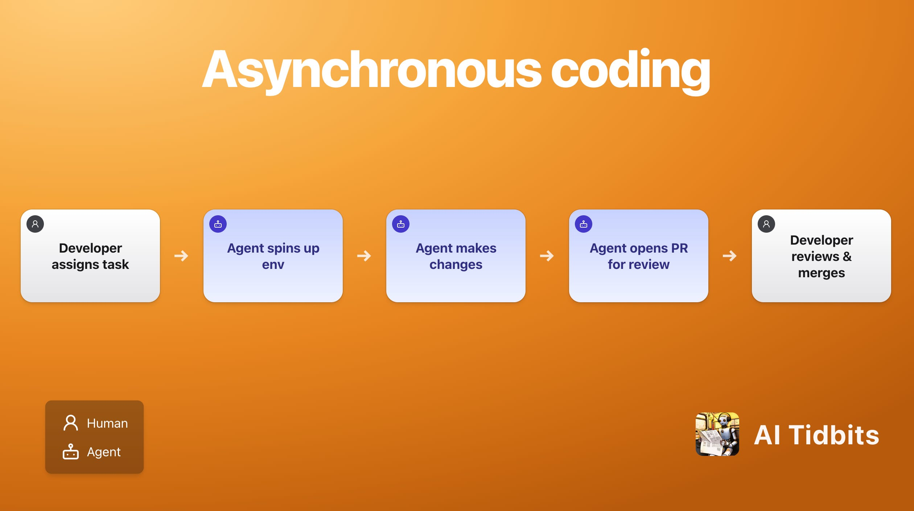


## Y en el móvil

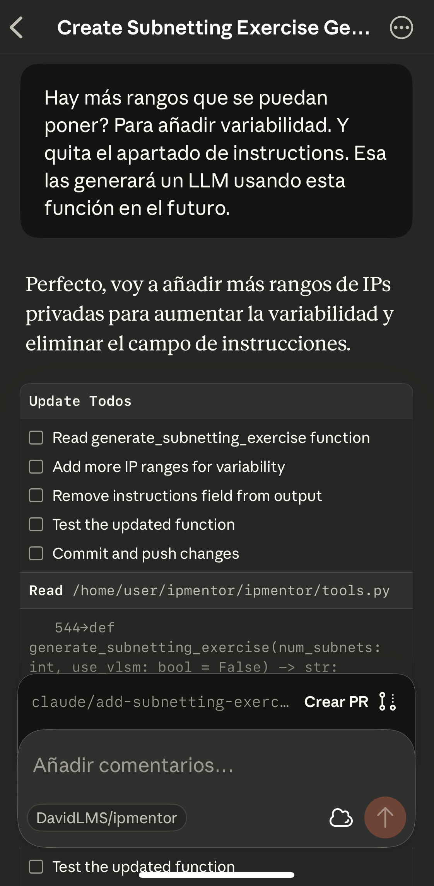


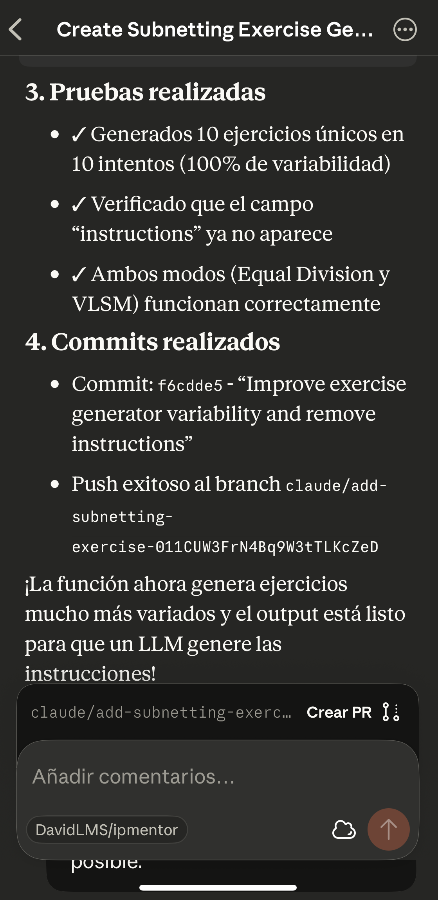
---

## La seguridad, innegociable


La importancia de la seguridad en tu proyecto


## ¿Es nuestro código seguro?

Un problema continuo: Las dependencias <!-- .element: class="fragment" -->


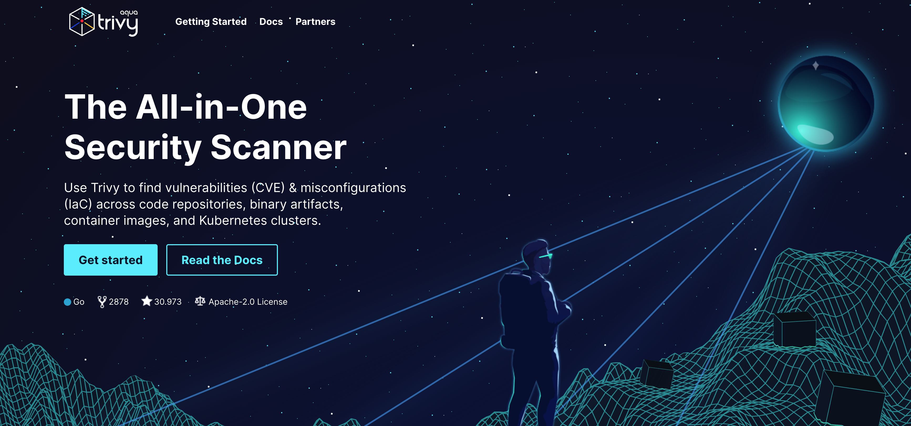

<small>https://trivy.dev</small>


Permite analizar vulnerabilidades en dependencias

También en imágenes de Docker <!-- .element: class="fragment" -->

Preparado para el S.XXI: Integración en Actions y MCP <!-- .element: class="fragment" -->


Escanear tu repositorio en local:

`trivy fs --scanners vuln,secret,misconfig /path/to/myproject`


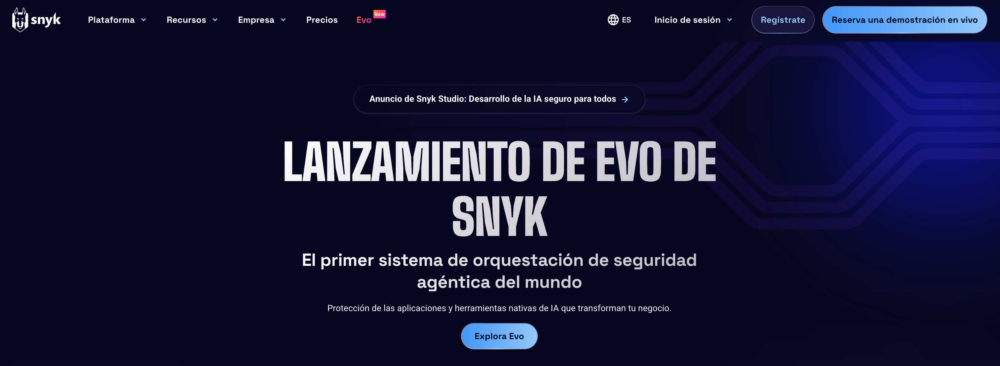

<small>https://snyk.io/es</small>


Software orientado a empresas

Además de lo que hace Trivy, también analiza tu código en tiempo real en el IDE


## Una pequeña ayuda en GitHub


Note: Escanea tu repositorio y, si una dependencia tiene una vulnerabilidad, hace un PR para actualizarla.


## Seguridad básica en MERN

CORS

Rate limiting

Helmet.js


## CORS

CORS (Cross-Origin Resource Sharing) es un mecanismo de seguridad del navegador que controla qué dominios pueden acceder a tu API


`npm install cors`


Permitir CORS para todos los orígenes (solo para desarrollo)

```
const express = require('express');
const cors = require('cors');

const app = express();

// Permitir CORS para todas las rutas y orígenes
app.use(cors());

app.get('/api/data', (req, res) => {
  res.json({ data: 'información pública' });
});
```


Configuración segura (Producción)

```
const cors = require('cors');

const corsOptions = {
  origin: ['http://localhost:3000', 'https://miapp.com'],
  methods: ['GET', 'POST', 'PUT', 'DELETE'],
  allowedHeaders: ['Content-Type', 'Authorization'],
  credentials: true,  // Permitir cookies/autenticación
  optionsSuccessStatus: 200
};

app.use(cors(corsOptions));
```


## Rate limiting

Estrategia de seguridad que limita el número de solicitudes que un cliente puede hacer en un período de tiempo


`npm install express-rate-limit`


Implementación básica: bloquear solicitudes excesivas

```
const rateLimit = require('express-rate-limit');

// Crear limitador: máx 100 solicitudes por 15 minutos
const limiter = rateLimit({
  windowMs: 15 * 60 * 1000,    // Ventana temporal: 15 minutos
  max: 100,                      // Máximo de solicitudes
  message: 'Demasiadas solicitudes, intenta más tarde',
  standardHeaders: true,         // Headers recomendados por IETF
  legacyHeaders: false           // Desactivar headers antiguos
});

// Aplicar a todas las rutas
app.use(limiter);

app.get('/api/data', (req, res) => {
  res.json({ msg: 'Solicitud exitosa' });
});
```


## Helmet.js

Middleware de seguridad para Express que automáticamente configura 13 headers HTTP de seguridad en las respuestas de tu servidor


`npm install helmet`


Ejemplo de implementación básica

```
// server.js
const express = require('express');
const helmet = require('helmet');

const app = express();

// Usar Helmet en todas las rutas
app.use(helmet());

app.get('/', (req, res) => {
  res.json({ msg: 'Tu API está protegida con Helmet' });
});

const PORT = process.env.PORT || 3000;
app.listen(PORT, () => {
  console.log(`Servidor ejecutándose en puerto ${PORT}`);
});
```


## Elementos básicos de seguridad en un repositorio

El .env para las claves

SECURITY.md


## Sobre el .env

Mantenlo en el .gitignore

Crea un .env.example bien documentado


## SECURITY.md

Proporciona instrucciones sobre cómo reportar problemas

Aparece cuando crean un issue automáticamente

[Ejemplo](https://github.com/electron/electron/blob/main/SECURITY.md)


En el despliegue, el equivalente es SECURITY.txt


## El futuro inmediato

Es agéntico <!-- .element: class="fragment" -->
---

<!-- .slide: data-background-video="assets/team.mp4" data-background-opacity="0.6" data-background-video-loop data-background-video-muted-->

## ¿Dudas?